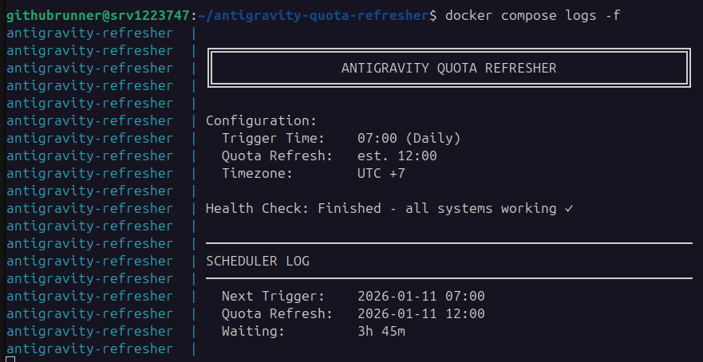
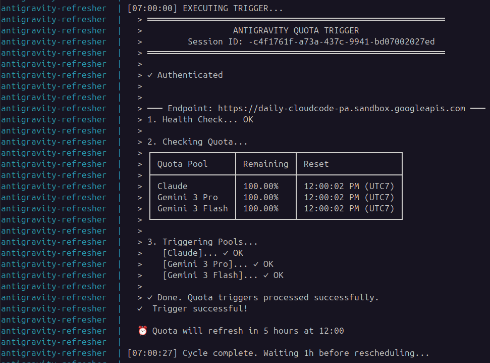

# Antigravity Quota Refresher

## The Problem

[Google Antigravity IDE](https://antigravity.google) quotas operate on a **5-hour rolling window** (for Google AI Pro / Ultra users). If you use it at 10:00, your quota refreshes at 15:00. For intense coding sessions, this falls a bit short.

## The Solution

Send (automated) minimal LLM prompts to all 3 quota pools (Gemini 3 Pro, Gemini 3 Flash, and Claude) hours **before** you work to start the rolling windows → quota refreshes mid-session.

> 💡 Each prompt consumes less than 0.5% of its pool's quota.

### Example Case - Comparison

#### ❌ Without Refresher

You start working at 10:00. Your quota starts draining immediately. **During intense sessions, quota burns much faster than 5 hours** — you might exhaust it in 2 hours. Either way, you're stuck waiting until the 5-hour rolling window expires.

```mermaid
gantt
    title Without Refresher
    dateFormat HH:mm
    axisFormat %H:%M
    todayMarker off

    section Quota
    Quota Rolling Window (5h)                :crit, 10:00, 5h
    ⚠️ Quota might be exhausted early        :milestone, m2, 12:00, 0d

    section Work
    Work Session                             :active, 10:00, 7h
    ⏰ Finally refreshes...                  :milestone, m1, 15:00, 0d
```



> ⚠️ **Problem:** Burn out at 12:00, but you must wait until 15:00 for refresh. **3 hours stuck.**

---

#### ✅ With Refresher

Trigger fires at 07:00 (before you wake up). That starts rolling window #1. You start working at 10:00. At 12:00, window #1 expires and **you get a fresh quota** — right when you need it.

```mermaid
gantt
    title With Refresher
    dateFormat HH:mm
    axisFormat %H:%M
    todayMarker off

    section Bucket 1
    ⚡ API Trigger Fires                     :milestone, t1, 07:00, 0d
    Quota Rolling Window 1 (5h)              :done, 07:00, 5h

    section Bucket 2
    Quota Rolling Window 2 (5h)              :active, 12:00, 5h

    section Work
    Work Session                             :w1, 10:00, 7h
    🔄 Fresh quota!                          :milestone, m1, 12:00, 0d
```



> ✅ **Benefit:** Mid-session refresh at 12:00 instead of 15:00. **3 extra hours of runway.**

---

| Scenario          | Refresh Happens | If Depleted at 12:00           |
|-------------------|-----------------|--------------------------------|
| ❌ Without        | 15:00           | 3 hours stuck waiting          |
| ✅ With Refresher | 12:00           | Already refreshed!             |

This allows you to work longer without worrying about quota depletion.

---

## ⚡ Quick Start

Highly recommended to deploy this in an always-on VPS (or local machine).

### 1. Clone

```bash
git clone https://github.com/leonidlouis/antigravity-quota-refresher.git
cd antigravity-quota-refresher
```

### 2. Setup

#### 2a. Authentication Token (Required)

You need to extract your authentication token from the Antigravity IDE.

**Option A: Running Locally (Same machine as IDE)**

If you are running this on the same computer where you use Antigravity IDE:

```bash
# 1. Extract the token
sudo apt install sqlite3 && ./export-token.sh
# (Or via NPM: npm install && npm run export-token)

# 2. Copy the token and save to .env
echo "ANTIGRAVITY_REFRESH_TOKEN=your_token_here" > .env
```

**Option B: Running on VPS (Recommended 24/7)**

Since your VPS likely doesn't have the Antigravity IDE, you must **export the token from your local machine first**.

1. **On Local Machine**:

    ```bash
    sudo apt install sqlite3 && ./export-token.sh
    # (Or via NPM: npm install && npm run export-token)
    ```

2. **On VPS**:

    ```bash
    # Create .env with the copied token
    echo "ANTIGRAVITY_REFRESH_TOKEN=paste_your_token_here" > .env
    ```

#### 2b. Telegram Notifications (Optional)

Get notified on your phone when triggers fire.

1. **Create Bot**: Message [@BotFather](https://t.me/botfather) on Telegram → `/newbot` → copy token
2. **Get Chat ID**:
   - Start a conversation with your new bot (send any message)
   - Visit: `https://api.telegram.org/bot<YOUR_TOKEN>/getUpdates`
   - Find `"chat":{"id":123456789}` in the response — that's your Chat ID
3. **Add to .env**:

   ```bash
   echo "TELEGRAM_BOT_TOKEN=your_bot_token" >> .env
   echo "TELEGRAM_CHAT_ID=your_chat_id" >> .env
   ```

> 💡 The deploy script will also prompt you to set this up interactively.

### 3. Deploy

```bash
./deploy.sh
```

That's it. The script will:

1. ✓ Ask for trigger time & timezone
2. ✓ Optionally set up Telegram (if not already configured)
3. ✓ Start the container with auto-restart
4. ✓ Test your API connection ← happens inside the container on startup

> **Note:** To update your trigger schedule, simply re-run the deploy script at any time.

### 4. Check Status (Optional)

```bash
docker compose logs -f
```

It should be fine, but it is still a good idea to monitor whether the logs are healthy.

A good startup looks like this:



A good cron / scheduler trigger looks like this:



Done! everyday on _[your configured time]_, your Antigravity Quota rolling window should be started.

---

## 🔧 Commands

| Command | Description |
| --- | --- |
| `docker compose logs -f` | View logs & status |
| `./export-token.sh` | Export token (Unix) |
| `npm run export-token` | Export token (NPM) |
| `./deploy.sh` | Deploy docker container for triggering rolling window (Interactive) |

---

## 📱 Telegram Notifications

What you'll receive when triggers fire:

**All pools at 100%:**

```text
✅ Antigravity quota usage triggered at 12:00

📊 Quota before trigger:
• Gemini 3 Pro: 100.00%
• Gemini 3 Flash: 100.00%
• Claude: 100.00%

5hr rolling window started.
Will be fully refreshed at 17:00
```

**Some pools already in use:**

```text
5hr rolling window started.
Partial refresh expected (not all pools were at 100%)
```

**All pools already in active cycle:**

```text
All pools already in active cycle — skipped.
```

**On failure:**

```text
❌ Antigravity quota trigger FAILED

All endpoints failed or are rate-limited.

Manual intervention required.
```

---

## Issues

Found a bug or have a suggestion? [Open an issue](https://github.com/leonidlouis/antigravity-quota-refresher/issues)!

---

## Credits

[wusimpl/AntigravityQuotaWatcher](https://github.com/wusimpl/AntigravityQuotaWatcher) • [shekohex/opencode-google-antigravity-auth](https://github.com/shekohex/opencode-google-antigravity-auth)

## Disclaimer

This tool is provided for educational and personal use only. The author assumes no responsibility for any consequences resulting from the use of this software. Use at your own risk.

## License

Distributed under the MIT License. See [LICENSE](LICENSE) for more information.
