# Antigravity Quota Refresher

## The Problem

[Google Antigravity IDE](https://antigravity.google.com) quotas operate on a **5-hour rolling window** (for Google AI Pro / Ultra users). If you use it at 10:00, your quota refreshes at 15:00. For intense coding sessions, this falls a bit short.

## The Solution

Trigger "dummy" API calls hours **before** you work to start rolling window → quota refreshes mid-session.

### Example Case - Comparison

#### ❌ Without Refresher

You start working at 10:00. Your quota starts draining immediately. **During intense sessions, quota burns much faster than 5 hours** — you might exhaust it in 2 hours. Either way, you're stuck waiting until the 5-hour rolling window expires.

```mermaid
gantt
    title Without Refresher
    dateFormat HH:mm
    axisFormat %H:%M

    section Quota
    Quota Rolling Window (5h)                :crit, 10:00, 5h
    ⚠️ Quota might be exhausted early        :milestone, m2, 12:00, 0d

    section Work
    Work Session                             :active, 10:00, 7h
    ⏰ Finally refreshes...                  :milestone, m1, 15:00, 0d
```



> ⚠️ **Problem:** Burn out at 12:00, but you must wait until 15:00 for refresh. **3 hours stuck.**

---

#### ✅ With Refresher

Trigger fires at 07:00 (before you wake up). That starts rolling window #1. You start working at 10:00. At 12:00, window #1 expires and **you get a fresh quota** — right when you need it.


> ✅ **Benefit:** Mid-session refresh at 12:00 instead of 15:00. **3 extra hours of runway.**

---

| Scenario          | Refresh Happens | If Depleted at 12:00           |
|-------------------|-----------------|--------------------------------|
| ❌ Without        | 15:00           | 3 hours stuck waiting          |
| ✅ With Refresher | 12:00           | Already refreshed!             |

This allows you to work longer without worrying about quota depletion.

---

## ⚡ Quick Start

Highly recommended to deploy this in an always-on VPS (or local machine).

### 1. Clone

```bash
git clone https://github.com/leonidlouis/antigravity-quota-refresher.git
cd antigravity-quota-refresher
```

### 2. Setup Token

You need to extract your authentication token from the Antigravity IDE.

#### Option A: Running Locally (Same machine as IDE)

If you are running this on the same computer where you use Antigravity IDE:

```bash
# 1. Extract the token
sudo apt install sqlite3 && ./export-token.sh
# (Or via NPM: npm install && npm run export-token)

# 2. Copy the token and save to .env
echo "ANTIGRAVITY_REFRESH_TOKEN=your_token_here" > .env
```

#### Option B: Running on VPS (Recommended 24/7)

Since your VPS likely doesn't have the Antigravity IDE, you must **export the token from your local machine first**.

1. **On Local Machine**:

    ```bash
    sudo apt install sqlite3 && ./export-token.sh
    # (Or via NPM: npm install && npm run export-token)
    ```

2. **On VPS**:

    ```bash
    # Create .env with the copied token
    echo "ANTIGRAVITY_REFRESH_TOKEN=paste_your_token_here" > .env
    ```

### 3. Deploy

```bash
./deploy.sh
```

That's it. The script will:

1. ✓ Test your API connection
2. ✓ Ask for trigger time & timezone
3. ✓ Start the container with auto-restart

### Re-Deploy / Change Trigger Time

```bash
./deploy.sh
```

### Check Status

```bash
docker compose logs -f
```

---

## 🔧 Commands

| Command | Description |
|---------|-------------|
| `docker compose logs -f` | View logs & status |
| `./export-token.sh` | Export token (Unix) |
| `npm run export-token` | Export token (NPM) |
| `./deploy.sh` | Deploy docker container for triggering rolling window (Interactive) |

---

## **Credits:**

[wusimpl/AntigravityQuotaWatcher](https://github.com/wusimpl/AntigravityQuotaWatcher) • [shekohex/opencode-google-antigravity-auth](https://github.com/shekohex/opencode-google-antigravity-auth)

## Disclaimer

This tool is provided for educational and personal use only. Use of this repository **may or may not breach Google's Terms of Service**. The author assumes no responsibility for any consequences resulting from the use of this software. Use at your own risk.

## License

Distributed under the MIT License. See [LICENSE](LICENSE) for more information.
